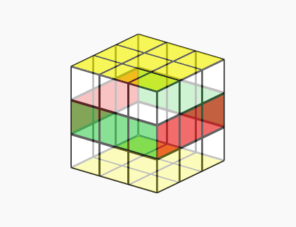
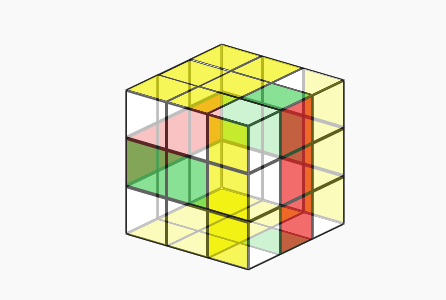

<a href="./" style="color: black; text-decoration: underline;text-decoration-style: dotted;">Back</a>
  
  
# Rubiks cube solver 
The challenge itself: 

When applying hte processing power of computers to a real-life application, the process requires several conditions be satisfied: the real-life can be translated to some form of data; the data might be manipulated

Satisifying both of these conditions simultainously to some degree of success is the largest obstacle for this problem. A cube has ~43 quintilliion unique permutations - can't use a lookup table. The pieces on a cube have both a permutation and an orientation - can't use a simple number based system or describe it with some hashign algorithm. The cube needs to be encoded into a manner that permits quick and efficient maniuplation for additional search hueristics or other puprposes. 

To tackle the first lemma, we must realise that a cube cannot be represented holistally on a computer in a way that one might represent a cube for a grahpical interface - a series of cubies in a 3d space with orientation and position data; we cannot represent it by it's "stickers" or facelets as that's simply too inefficient. Realising this, we might conclude that we can represent a cube by both the **identity** of the pieces and their orientation.

Again, to allow for efficient manipulation, we decide to represent the identity and orientation of some different classes of pieces, such as corners or edges, as required. 

Assumign some such systems exist, we can therefore conclude that an application data-stcuture for representing a cube is a system of coordinates that can each represent a cube. In it's simplist form, a cube can be represented by 4 coordinates corncering the orientaiton and position of both the edges and the corners. We have satisfied the first lemma. 

The second lemma warrents that the data strcuture we have created can be easily manipulated: seperating both the orientation and identiy of the pieces on the cube we can quite easily manipulate them simply by exchanging the identiy of the pieces in specified locations, and "applying" some additional orientation factor to the pieces as they are manipulated. We can store the aforementioned locations and change-in-orientation as pre-defined "moves" that we can apply to the move through a slightly m ore complicated applicaiton of the above method. 

## The two phase algorithm

Each cube can be represented by a series of coordinates that each describe an attribute of that cube. For instance, the orientation of the corners and the edges, or the position of some pieces. 

Certain turns of the cube's faces do not effect some of these attributes. For instance, double turns of any face but the cube's relative top and bottom will not change the orientation of the corners or edges.

With this information, it's possible to split the cube's various states into different groups or *co-sets* that are achievable whilst a constraint has been placed on the moves you can apply to the cube.

# Phase One
The first group, you only consider the orientation of the corners and edges, as well as the position of the edges in
the *UD-slice* - the positions sandwiched between the U and D faces. You do not consider how these edges are orientated
or positioned, just which positions are occupied by these middle edges.

This effectively limits both the quantity of data you have to keep tract of when manipulating the cube (for instance,
the position of edges and corners are only later considered), and the distance you have to search through to reach the "
solved" state of this group, or the identity element - a cube where the edges and corners are orientated correctly, and
where the UD-slice edges - the edges that originate from the UD-slice of a solved cube - are in their home slice.

The aforementioned coordinates are represented in various ways that are each optimised for their uses:

### The corner orientation coordinate

A corner can be orientated one of three ways which; a ternary number system is perhaps the most fitting method of
representing each corner's orientation.

- **0** implies that the corner is not rotated from its default state (as defined in some basic setup)
- **1** that the corner has been twisted once clockwise
- **2** that the conner has been twisted twice clockwise - this is synonymous with an anti-clockwise rotation.

It follows that we can store the orientation of each corner as `ori = ori mod 3` to ensure that the orientation
doesn't "grow" as it changes throughout the solve.

To minimise the size of the ternary number, we can exclude the last corner, now only using 7 bits, as for a cube to be
reachable through valid means the sum of all the orientations of the corners (modulo 3) must satisfy `sum modulo 3 = 0`.
Intuitively this means that there is not a singular corner twisted individually, as a turn of the face will always
impact 4 corners.

The following function reduces the orientation of the corners to a ternary number within the
range `3 pow 7 - 1 = 2186 <---> 0`:

`[0, 2, 2, 0, 2, 2, 1, 0] --> 673`

```python
def corner_orientation_coordinates(self):
    co = reduce(lambda variable_base, total: 3 * variable_base + total, self.co[:7])

    return co
```

The following does the opposite, taking the index of the element in the corner orientation co-set of the cube group and
computing the orientation of the corners:

```python
def Ocorner_coords(self, index):
    parity = 0
    self.co = [-1] * 8
    for _ in range(6, -1, -1):
        parity += index % 3
        self.co[_] = index % 3
        index //= 3

    parity %= 3
    parity = self.__Ocorner_parity_value[parity]
    self.co[-1] = parity
```

### The edge orientation coordinate
The orientation of the edges can be defined in much the same way - a binary system is used where *0* implies an unflipped edge and *1* the contrary.

Again, a similar method can be used to minimise the size of said number: the orientation of the final edge is omitted and calculated such that `sum mod 2 = 0`.
```python
@property
def Oedge_coords(self):
    eo = reduce(lambda variable_base, total: 2 * variable_base + total, self.eo[:11])

    return eo
```
The index of the element has range `2 pow 11 - 1 = 2047 <---> 0` and the following function reverses it in a similar manner to the corners:
```python
@Oedge_coords.setter
def Oedge_coords(self, index):
    parity = 0
    self.eo = [-1] * 12
    for _ in range(10, -1, -1):
        parity += index % 2
        self.eo[_] = index % 2
        index //= 2

    self.eo[-1] = parity % 2
```

### The UD-slice coordinate
The UD-slice coordinate uses a different encoding method altogether. At this point in the algorithm, the only nessessary data is **where** the UD-slice edges are, and not how they are rotated or where they are each positioned.

There are 4 edges, each of which can exist in one of 12 edges and it follow that the coordinate has range `2*11*10*9/4! - 1 = 494`.

The algoritm uses an array to represent each elelent in the UD-slice co-set much as the other methods of encoding expalined above, however assignes each of the elements in said array with a weight correspoding to their position `0, 1... 10, 11` and works from right to left: 

The number of UD-slice edges seen at the beginning of the algorithm is `4 - 1=3` such that `C(weight, seen_edges)` calculates the set of combinations of the remaining edges in the remaining spaces. This only works as all UD-slice edges are consiered homogenous here, so they are completely interchangable with one another. 

The algorihtm maps each element to an index on a 1 to 1 basis, and the identity elemnent is 0 here also, representing when the UD-slice edges are all stacked in final 4 positions in the array. Intuitively this means that they are all present in the UD-slice, but not necessarily in the right position nor orientation for the cube to be consiered solved. When the order of the edges are defined, the UD-slice edges are defined last, such that this method of encoding is applicable:

```python
class edge_indices(IntEnum):
    UR = 0
    UF = 1
    UL = 2
    UB = 3

    DR = 4
    DF = 5
    DL = 6
    DB = 7

    FR = 8
    FL = 9
    BL = 10
    BR = 11
```

The above describes the following algorithm: 
```python
@property
def POSud_slice_coords(self):
    blank = [False] * 12
    for i, corner in enumerate(self.ep):
        if corner >= 8:
            blank[i] = True

    coord = 0
    count = 3

    for i in range(11, -1, -1):
        if count < 0:
            break

        if blank[i]:
            count -= 1
        else:
            coord += CNK(i, count)

    return coord
```
And the following reverses the above, returning an array for the edge permutation that uses each edge indiscriminatnely, only ensuring that each UD-slice edge is placed correctly such that it can be mapped back to the same index of the co-set:

```python
@POSud_slice_coords.setter
def POSud_slice_coords(self, index):
    count = 3
    self.ep = [False] * 12

    for i in range(11, -1, -1):
        if count < 0:
            break

        v = CNK(i, count)

        if index < v:
            # noinspection PyTypeChecker
            self.ep[i] = 8 + count
            count -= 1
        else:
            index -= v

    others = 0
    for i, edge in enumerate(self.ep):
        if not edge:
            # noinspection PyTypeChecker
            self.ep[i] = others
            others += 1
```

The first phase of the algorithm combines all three of these coordinates, first calculating the coordinates of the cube provided by the user, before searching simultainiously through each one of those co-sets to find a sequence of any moves that take each of the coorindates to (0). 

It is worth noting that the first group's group operations (the moves) are not limited here as they are elsewhere in the algorithm, so for each and every element there are 18 operations that will take you to another element in the group. Whilst searching however, the same move is not allowed to be applied consequentively as this is simply synoymous with another move that is considered a singular move instead of two `self.axis[node_depth - 1] in (axis, axis + 3)`.

# Phase Two
When a sequence of moves has been found that maps the given cube to the identity element of H1, that new cube acts as the new root of the search in phase two. 

Again you attempt to search a subgroup of the Cube group, this time with teh assurance that both the corners and edges are orientated correctly and the UD-slice edges are in their *home-position*. 

Some basic intuitive sees that any single move of the right, front, left or back face will change the orientation of some edges and some corners and shift some of the UD-slice edges out of the UD-slice. It follows therefore that you constrain the search to moves only pertaining to double turns of the front, right, left and back faces such that you maintain the neuatral orientation of the cubes pieces. You can however, still move the up and down faces in single turns as this does not effect any of the aforementioned attributes. 

This again limits the search space as the moves requried to restore a cube from this position is minimal, and the branching factor of the search is significnatly reduced as a result of teh constraints placed on the possible moves. 

You may conclude therefore that the only coordinates that need be mentioned as those that describe the permutation of the pieces on the cube, namely teh corner permutation, the permutation of the UD-slice edges and those edges that do not fall into that group. 

### The edge permutation coordinates

On a cube, there are 12 edges and assume the orientation is constant between them as provided by phase 1, there are `fact 12 - 1 = 479001599` possible permutations for the edges. Even for a modern computer, generating teh tables required to navigate a search space of that size is not a feasable task, therefore the problem is broken down into two sections - the edges of the UD-slice and those contained in the up and down face:

#### The edge8 coordinate

When the edges are defined, a natural order is given to them as shown briefly above. 

Given the nature of a permutation, it follows that you use an ecoding system with a variable base such as the factoradic number system, where each element in a factoradic number is assigned a weight according to `fact weight` and the max size of that digit is `wight - 1`. This is a one to one number sytsem that maps one of `fact 8 - 1 = 40319` permutations to a single coordinate and back again. 

You work from **right to left**, starting from the 8th edge (we ignore those to the right - the UD-slice edges), with a weight of **7 decending**. You look at the edge contained at that position in the permutation `DR` and consider those edges higher in the natural order than it to the left of that edge in the permutation `2`.

You are then able to multiply the weight by the number of edges higher in order than itself, before summing that to the total `7 fact * 2 = 10080` and repeating this process as you work left, ignore the 1st edge in the permutation as that is simply implied by that's left behind.

Like the above encoding methods, the identity element of the group (a solved cube) has the edge permutation coordinate of 0 as all edges are in the defined order, where each edges integer value is higher than that of it's left-adjacent edges.

The following is the algorithm that describes the permutation of the 8 edges in the method described above: 

```python
@property
def P8edge_coords(self):
    coord = 0

    for p in range(7, 0, -1):
        higher = 0
        for edge in self.ep[:p]:
            if edge > self.ep[p]:
                higher += 1

        coord = (coord + higher) * p

    return coord
```

This reverses the above with an intuitive approach:

```python
@P8edge_coords.setter
def P8edge_coords(self, index):
    corners = list(range(8))
    self.ep[:8] = [-1] * 8
    coeffs = [0] * 7
    for i in range(2, 9):
        coeffs[i - 2] = index % i
        index //= i

    for i in range(7, 0, -1):
        self.ep[i] = corners.pop(i - coeffs[i - 1])

    self.ep[0] = corners[0]
```

#### The edge4 permutation coordinate

The edge4 permutation coordintae simply describes the permutation of the edges contained within the UD-slice in an analogous manner to that of the edge8's encoding algorithm where the identity cube has teh corner permutation coordinate of 0, only this time describing the last 4 edges in an array of edges:

```python
@property
def P4edge_coords(self):
    cord = 0
    ep = self.ep[8:]
    for p in range(3, 0, -1):
        higher = 0
        for edge in ep[:p]:
            if edge > ep[p]:
                higher += 1

        cord = (cord + higher) * p

    return cord
```
The reverse:
```python
@P4edge_coords.setter
def P4edge_coords(self, index):
    self.ep[8:] = [-1] * 4

    corners = list(range(8, 12))
    coeffs = [0] * 3
    for i in range(2, 5):
        coeffs[i - 2] = index % i
        index //= i

    for i in range(3, 0, -1):
        self.ep[8 + i] = corners.pop(i - coeffs[i - 1])

    self.ep[8] = corners[0]
```

### The corner permutation coordinate

Again, the permutation of the corners can be described by a coordinate using the factoradic number system: 

```python
@property
def Pcorner_coords(self):
    index = 0
    for p in range(7, 0, -1):
        higher = 0
        for corner in self.cp[:p]:
            if corner > self.cp[p]:
                higher += 1

        index = (index + higher) * p

    return index
```
The contrary:
```python
@Pcorner_coords.setter
def Pcorner_coords(self, index):
    corners = list(range(8))
    self.cp = [-1] * 8
    coeffs = [0] * 7
    for i in range(2, 9):
        coeffs[i - 2] = index % i
        index //= i

    for i in range(7, 0, -1):
        self.cp[i] = corners.pop(i - coeffs[i - 1])

    self.cp[0] = corners[0]
```

Phase two of the solver uses those 3 coordinates to find a sequence of moves that map the identity cube of H1 where the pieces are orientated correctly and the UD-slice edges are in the correct slice, to a solved cube where the permutations of the cubes pieces are corrected.


# Data structures


## Facelet level
The cube must first be defined by a 1d string of characters that represent the colours of each of the 54 facelets present on the cube. This format is easiest to display in GUI's so will be trasitioned to when passing information to and from the solver.

The faclets are numbered from **top-down from left to right**, and *axis* are defined in order below:

Note that the **IntEnum** module is used to allow the program to allow for the axis to be treated as integers, as well as providing some functional utility for debugging later as it's much easier to comprehend the axis `u` as opposed to the integer `0`.

```python
class colours(IntEnum):
U = 0
R = 1
L = 2
F = 3
B = 4
D = 5
```

```python
class facelet_indices(IntEnum):
U0 = 0
U1 = 1
U2 = 2
U3 = 3
U4 = 4
U5 = 5
U6 = 6
U7 = 7
U8 = 8
R0 = 9
R1 = 10
R2 = 11
R3 = 12
R4 = 13
R5 = 14
R6 = 15
R7 = 16
R8 = 17
L0 = 18
L1 = 19
L2 = 20
L3 = 21
L4 = 22
L5 = 23
L6 = 24
L7 = 25
L8 = 26
F0 = 27
F1 = 28
F2 = 29
F3 = 30
F4 = 31
F5 = 32
F6 = 33
F7 = 34
F8 = 35
B0 = 36
B1 = 37
B2 = 38
B3 = 39
B4 = 40
B5 = 41
B6 = 42
B7 = 43
B8 = 44
D0 = 45
D1 = 46
D2 = 47
D3 = 48
D4 = 49
D5 = 50
D6 = 51
D7 = 52
D8 = 53
```

Each character in the string coresponds to a faclet on the cube, as is defined in the above fashion.

A solved cube in facelet defintion will look like this:
```
UUUUUUUUURRRRRRRRRLLLLLLLLLFFFFFFFFFBBBBBBBBBDDDDDDDDD
```
This is the **identity** cube defined in terms of its facelets.

To convert from this format to the next level, the coordinate level, we must identify which of the defined pieces correspond to the pieces in the string. 

For simplicity’s sake it's best we only look at the way the corners are calculated but the edges are established in a similar process:

The cube has 8 defined corner positions, each of which with its own integer value.
```python
class corner_indices(IntEnum):
    URF = 0
    UFL = 1
    ULB = 2
    UBR = 3
    
    DFR = 4
    DLF = 5
    DBL = 6
    DRB = 7
```

```python
corner_facelet_indices: list[tuple[facelet_indices, facelet_indices, facelet_indices]] = [
    (facelet_indices.U8, facelet_indices.R0, facelet_indices.F2),
    (facelet_indices.U6, facelet_indices.F0, facelet_indices.L2),
    (facelet_indices.U0, facelet_indices.L0, facelet_indices.B2),
    (facelet_indices.U2, facelet_indices.B0, facelet_indices.R2),
    (facelet_indices.D2, facelet_indices.F8, facelet_indices.R6),
    (facelet_indices.D0, facelet_indices.L8, facelet_indices.F6),
    (facelet_indices.D6, facelet_indices.B8, facelet_indices.L6),
    (facelet_indices.D8, facelet_indices.R8, facelet_indices.B6)]
```
We are therefore about to define each corner `URF --> 0` by the index of the facelets `(facelet_indices.U8, facelet_indices.R0, facelet_indices.F2)`it represents in it's facelet definition.

This is of course under the premise that the cube is static so the facelets that compose each one of those positions occupies will not change.

When given a string and asked to work out the corner permutation in the form of an array therefore, we might loop through each of the defined corners, looking up which indices in the string represent said corner, and checking to see which of the defined corners those facelets represent. For this, we are able to define the corners in terms of what axes they are composed of in clockwise order: 
```python
corner_axes = [
    (axes.U, axes.R, axes.F),
    (axes.U, axes.F, axes.L),
    (axes.U, axes.L, axes.B),
    (axes.U, axes.B, axes.R),

    (axes.D, axes.F, axes.R),
    (axes.D, axes.L, axes.F),
    (axes.D, axes.B, axes.L),
    (axes.D, axes.R, axes.B)]
```


### The algorithm: 
```python
def to_cubeie_cube(self):
    co = [0] * 8
    cp = [0] * 8
    for i, corner in enumerate(self.corners):
        for o, f in enumerate(corner):
            if f == 0 or f == 5:
                break

        f1 = corner[(o + 1) % 3]
        f2 = corner[(o + 2) % 3]

        for j, c in enumerate(corner_axes):
            if f1 == c[1] and f2 == c[2]:
                co[i] = o
                cp[i] = j
                break

    eo = [0] * 12
    ep = [0] * 12

    for t, edge in enumerate(self.edges):
        for k, cols in enumerate(edge_axes):

            if edge == cols:
                eo[t] = 0
                ep[t] = k

            elif edge[0] == cols[1] and edge[1] == cols[0]:
                eo[t] = 1
                ep[t] = k

    cc = cubiecube(cp, co, ep, eo)

    return cc
```
When implimenting the apoproach described prior, it's quicker to establish both the identity of the corner and the orientation of it simultainously:

```python
def to_cubeie_cube(self):
    co = [0] * 8
    cp = [0] * 8
```
Create blanks for both the corner permtuation and the corner orientation
```python
    for i, corner in enumerate(self.corners):
```
Loop through the corners in the string provided, obtaining each by referencing the indicies of each corners position.
```python
        for o, f in enumerate(corner):
```
Loop through each of the facelets `f` in the corner, keeping track of how many clockwise rotations `o` it takes to get to that facelet from the first - that which represents a neutral orientation
```python
            if f == 0 or f == 5:
                break
```
Check to see whether the facelet belongs to either the up or the down face - the faces which correspond to neutral. 
```python
        f1 = corner[(o + 1) % 3]
        f2 = corner[(o + 2) % 3]
```
Get the other facelets present on the corner in a clockwise manner indexing from the neutral facelet we found above. 
```python
        for j, c in enumerate(corner_axes):
```
Loop through each of the corners we defined in terms of their axes.
```python
            if f1 == c[1] and f2 == c[2]:
                co[i] = o
                cp[i] = j
                break
```
Check whether this combination of facelets, in this order, exists before settings both the corner orientation and permutation in the blank defined above. 

The loop repeats until every corner has been checked, before a similar process is executed for the edges. 

This process allows us to take a facelet definition and elevate it to a higher data structure for easier manipulation - the cubie cube.

## Cubie level

At this level, the cube can be represented by 4 arrays. 

A solved cube: 
```python
edge_orientation = [0, 0, 0, 0, 0, 0, 0, 0, 0, 0, 0, 0]
edge_permutation = [0, 1, 2, 3, 4, 5, 6, 7, 8, 9, 10, 11]

corner_orientation = [0, 0, 0, 0, 0, 0, 0, 0]
corner_permutation = [0, 1, 2, 3, 4, 5, 6, 7]
```

Whilst these arrays can more compactly be stored and searched through with correspoding numbers using the encoding system described intially, it's impossible to foresee how a move can effect a coordinate. It follows that we apply moves onto the cube at this level where pieces are distinct maleable. 

The moves are defined using a **repalced by** notation, for example a single clockwise rotation of the right face: 

```python
cpR = [c.DFR, c.UFL, c.ULB, c.URF, c.DRB, c.DLF, c.DBL, c.UBR]
coR = [2, 0, 0, 1, 1, 0, 0, 2]
epR = [e.FR, e.UF, e.UL, e.UB, e.BR, e.DF, e.DL, e.DB, e.DR, e.FL, e.BL, e.UR]
eoR = [0, 0, 0, 0, 0, 0, 0, 0, 0, 0, 0, 0]
```

Let's look first at the permutation of the corners `cpR`: 

Note that a default array will be such, where each of the corners describes the position in the cube: 

```python 
cp = [c.URF, c.UFL, c.ULB, c.UBR, c.DLF, c.DBL, c.DRB, c.DFR]
```

The first corner in `cpR[0] --> c.DFR` refers to piece, or the position of the piece, that will replace the cubie present at that position in the array.

In other words, the corner in the position `up-right-front` will be replaced by the piece present at `down-front-right` under the move of a single turn of the right face.

We are not removing or adding corners to the permutation, we are simply exchanging them with one another. 

When manipulating the corners and applying a move to the whole of the permutation, it follows that we simply apply the same rule.

```python
def Cmove(self, to_apply):
    self.cp = [self.cp[to_apply.cp[i]] for i in range(8)]
    self.co = [(self.co[to_apply.cp[i]] + to_apply.co[i]) % 3 for i in range(8)]
```


Intuitively this translates to the following prodcedure: 

1. Loop through each of the elements `i` in the definition of the move being applied, getting the position of the corner that replaces the current.
2. Using the nature of position - an integer value - to index the current permtuation and replace the corner at each `i`.

## Coordinate level 

To understand what is ocuuring here a bit of group theory is useful. 

The cube has many states, each one can be reached by performing a sequence of moves to a solved cube. Each of these final states - a mixed-up cube - will be thought of the result of said sequence of moves. 

The gube group **G** therefore, is composed of quintillions of **permutations** that each result in a different final cube. 

You can "divide" this permutations up into smaller **subgroups** by some attribute of each permutation, such as corner orientation or position of the edges. In each of these cases we group them by these defining factors and ignore the others. 

One such subgroup is the subgroup we will call H:

Let's imagine a solved cube, then restickering it in a such a fashion: 



Opposite colours are restickered to be homogenous, and all the stickers that do not constitute a part of a UD-slice or top/bottom face are removed. 

This cube is a "default" cube from the subgroup H of the cube group, where every edge/corner is orientated correctly, and the UD-slice edges are in their home slice. 

Note that the cube could be one of many variations under this "restickered" process, where corners could be indisriminately exchanged with one another and you would be none the wiser as those variations are ommitted under this process. 

Intuitively it's fairly easy to work out that the cardinality - or the number of elements in -  of the subgroup H is `8!8!4!/2 = 19,508,428,800`. More simply, the number of variations of the restickerd cube shown above is aproximately 19 billion - `8!` ways to permutate the top and bottom edges withotu changing the orientations, `8!` ways to permutate the edges in the top and bottom faces withou changing the orientation,and `4!` ways to permutatino the edges in the middle. The `/2` is derrived from the notation that each rotation of teh cube's faces effects an even number of corners and edges - some "odd" permtuations and orientations are simply not possibel withotu dissassembling the cube itself.

So, the subgroup H has 19.5*10^8 variations within that constitute to this "default" position, and our objective in phase one is find a series of moves that take our scrambled cube to one that is a part of this cubegroup. 

At the coordinate level, all cubes within H simultainiously have a corner orientation coordinate of 0, an edge orientation coordinate of 0 and a UD-slice coordinate of 0:

`H = (C ∩ E ∩ UD), C = {g: g ∈ G, g.corner_orientation = 0}, E = {g: g ∈ G, g.edge_orientation = 0}, UD = {g: g ∈ G, g.UDslice_position = 0}`

So the subgroup H is composed of all cubes that satisfy H's specific conditions, but as implied by the premise of a subgroup it's only a fraction of the whole group G. 

Let's imagine that we take that solved but restickered cube, and we apply some move to it. It's H form - restickered as shown above - is completely unique:



From it spawn another 19,508,428,800 variations within, that shuffle about all of the pieces such that is still holds the same H form above when restickered, but are wholistically different. Again, apply another move and you have another 19,508,428,800 varitations th at conform to that same H form. 

In the language of group theory, the subgroup H is defined above as the group of all elements in G which fit it's requirements, where each element is a permutation of the cube group itself. We apply some move `M` to the subgroup H to create a **coset**: 

`H*M = {h*M: h ∈ H}, where * is the group operation of a move. `

It reasons that you might continue this process, apply some moves to the "default" H cube until every permutation in G is defined as part of a coset of H. 

It reasons that to obtain all the elements of G again using a subgroup as a "coposer" of sorts we might have `|G|/|H| = 2,217,093,120` cosets or variations of H. 

This process of reasoning leads us to the conclusion that every single permutation `p` in G belongs to a coset of H `p ∈ H*M`. The group operation of a move is obviously commutative, so a serious of moves `M` can be reversed by simply doing it in reverse `M'`, therefore you might conclude that any permutation `p ∈ G, p ∈ H*M` can be returned to one of 19,508,428,800 elements `p'` in the normal subgroup H by finding `M'` and applying that to the cube. 

Coordinates allow us to navigate this problem. The tuple comprised of the three phase-1 coordinates direct us to some coset `H*M` of H, and our object is to find the sequence of moves `M'` that return our coordinates to the normal subgroup - we know this has occured when the tuple renders to `(0, 0, 0)`. 

We might repeat this process for phase two, using our member of the subgroup H to navigate through it the alternative subgroup Q, which generates 10,863,756,288,000 cosets of 3,981,312 elements each under the premise that we only use half turns of the side faces and any turn for the top and bottom - changing the position of pieces but maintaining their orientation. Given these factors and the premise that the orientations are set from phase one, by again finding the inverse of the sequences of moves such that we might return the cube to a solved state.   
