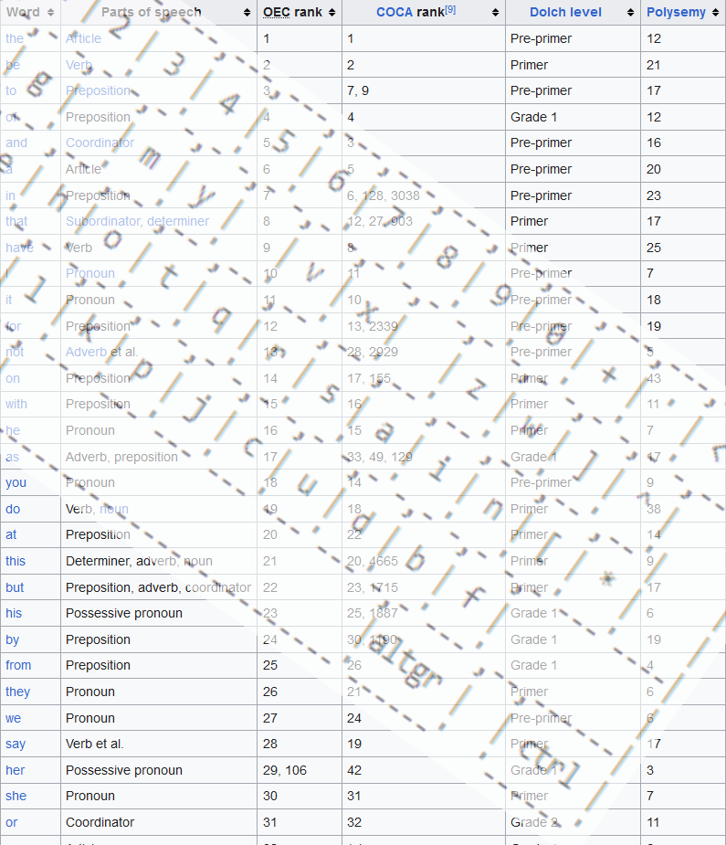

**Hi, I'm Oliver...**

Take a look at some of my projects as well as their accompanying blog posts. The accompanying code (and some additional projects I have yet to write blog posts for) can be found on my [GitHub](https://github.com/OPaynterJones):

<h1 align="center">Genetic Keyboard</h1>

  

--- 

<h1 align="center">Suduko Solver</h1>

  

---

<h1 align="center">Rubiks Cube Solver</h1>

  

